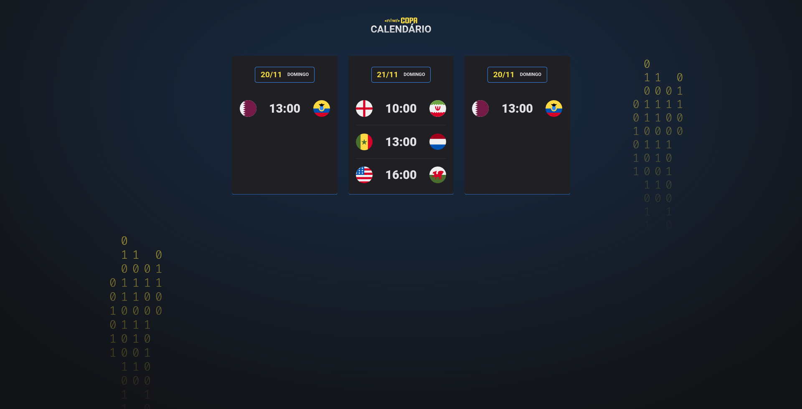

<h1 align="center">
    Calendário Copa Qatar - NLW
</h1>

Tabela de conteúdos
=================
   * [Sobre o projeto](#-sobre-o-projeto)
   * [Layout](#-layout)
   * [Tecnologias](#-tecnologias)
     * [Principais](#principais)
     * [Ultilitario](#utilitários)
   * [Autor](#-autor)
   * [Licença](#-licença)

---

## 💻 Sobre o projeto

Aplicação que tem como objetivo expor as datas dos confrontos da copa do mundo de futebol do Catar 2022. Essa aplicação frontend desenvolvida na NLW - RocketSeat.

---

## 🎨 Layout
O layout desenvolvido por profissionais da NLW pode ser acessado no [Figma](https://www.figma.com/file/Iew5OmxaXAI1RVaCah84S0/Calend%C3%A1rio-de-Jogos-(Community)?node-id=175%3A3234)

|Desktop|Mobile|
|---|---|
|||

---

## 🛠 Tecnologias

As seguintes ferramentas foram usadas na construção do projeto:

-   **HTML e CSS**
-   **JavaScript**
-   **Git e Github**

## 🦸 Autor

<a href="https://t.me/lgabrielb">
 
  
Lucas Gabriel
  

  
  
  

---

## 📝 Licença

Este projeto esta sobe a licença [MIT](./../LICENSE).

Feito por Lucas Gabriel 👋🏽 [Entre em contato!](https://www.linkedin.com/in/lucas-gabriel-4860b4228)

---

##  Versões do README

[Português 🇧🇷](./README.md)  |  [Inglês 🇺🇸](./README.md)
